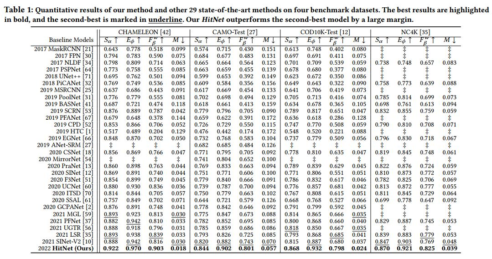

## [High-resolution Iterative Feedback Network for Camouflaged Object Detection（AAA23）](https://arxiv.org/pdf/2203.11624.pdf)

The more qualitative results of HitNet on four benchmarks (CAMO, CHAMELEON, NC4K, COD10K) have already been stored in [Google Drive](https://drive.google.com/file/d/1dtsSXrFryBujpzXc7RX_ci2xnFPw5QzA/view?usp=sharing). <br>

The pretrained model is stored in [Google Drive](https://drive.google.com/file/d/1H3UeZzOk7KL7_-SkUvk6Qijjq_dQrE98/view?usp=share_link). After downloading, please put it in the pretrained_pvt fold.

Our well-trained model is stored in [Google Drive](https://drive.google.com/file/d/1XPncP4DyMgvPl-6NFQVuAahAXZngw6Vf/view?usp=share_link), which should be moved into the fold 'model_pth'. Google driver is out of service, please refer to [Huggingface](https://huggingface.co/stablediffusionuser/hitnet/tree/main).If you have any quesetion, please let me know!

run sh train.sh for training, test.sh for testing.

 <br>


<br>

```

@article{hu2022high,
  title={High-resolution Iterative Feedback Network for Camouflaged Object Detection},
  author={Hu, Xiaobin and  Wang,Shuo and Qin, Xuebin and Dai, Hang and Ren, Wenqi and Tai, Ying and Wang, Chengjie and Shao, Ling},
  journal={arXiv preprint arXiv:2203.11624},
  year={2022}
}

@inproceedings{hu2023high,
  title={High-resolution iterative feedback network for camouflaged object detection},
  author={Hu, Xiaobin and Wang, Shuo and Qin, Xuebin and Dai, Hang and Ren, Wenqi and Luo, Donghao and Tai, Ying and Shao, Ling},
  booktitle={Proceedings of the AAAI Conference on Artificial Intelligence},
  volume={37},
  number={1},
  pages={881--889},
  year={2023}
}

